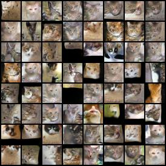

# this-cat-does-not-exist
Generative adversarial network for cats. Do you need one?

# Results

Real cats:


Generated cats (update over time):



## Basic information
- Device: NVIDIA GTX 1070 (8GB)
- Number of cat Images: 9992

# Image cropping and alignment
- Use cat-gan-batch-resize-images.ipynb to crop and align cat faces
- use aligned square image to perform training

# StyleGAN2
- 

## Current training
- Epochs: 18000
- Gradient accumulation 8 epochs
- Generated image size: 32x32

# Basic requirements
 - Pytorch (CUDA 11)
 - Python-pip
 - dataset (please send Email to **lxgfrom2009 [at] gmail [dot] com** to get aligned cat face dataset)

# References
## Stylegan2 credit
https://github.com/lucidrains/stylegan2-pytorch/

## Raw Cat dataset credit
https://www.kaggle.com/crawford/cat-dataset

## Research Paper
```
@article{zhao2020diffaugment,
    title   = {Differentiable Augmentation for Data-Efficient GAN Training},
    author  = {Zhao, Shengyu and Liu, Zhijian and Lin, Ji and Zhu, Jun-Yan and Han, Song},
    journal = {arXiv preprint arXiv:2006.10738},
    year    = {2020}
}

@misc{sinha2020topk,
      title   = {Top-k Training of GANs: Improving GAN Performance by Throwing Away Bad Samples},
      author  = {Samarth Sinha and Zhengli Zhao and Anirudh Goyal and Colin Raffel and Augustus Odena},
      year    = {2020},
      eprint  = {2002.06224},
      archivePrefix = {arXiv},
      primaryClass = {stat.ML}
}

@article{Karras2019stylegan2,
  title   = {Analyzing and Improving the Image Quality of {StyleGAN}},
  author  = {Tero Karras and Samuli Laine and Miika Aittala and Janne Hellsten and Jaakko Lehtinen and Timo Aila},
  journal = {CoRR},
  volume  = {abs/1912.04958},
  year    = {2019},
}

@misc{zhao2020feature,
    title   = {Feature Quantization Improves GAN Training},
    author  = {Yang Zhao and Chunyuan Li and Ping Yu and Jianfeng Gao and Changyou Chen},
    year    = {2020}
}

@misc{chen2020simple,
    title   = {A Simple Framework for Contrastive Learning of Visual Representations},
    author  = {Ting Chen and Simon Kornblith and Mohammad Norouzi and Geoffrey Hinton},
    year    = {2020}
}